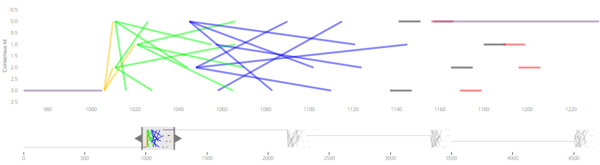
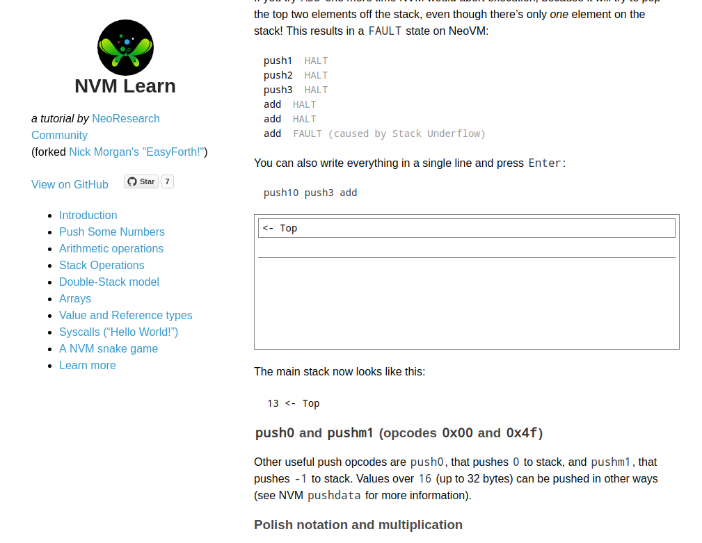
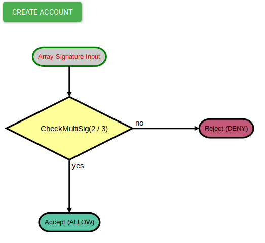

   
    

## NeoResearch Community

### Report P1: February, 2018 - May, 2019

### History

Around October, 2017, NeoResearch founders contacted members of existing NEO communities regarding the possibility and interest of having an online platform for NEO Smart Contracts, and other interesting research topics on NEO platform.
At that time, no public interest was shown in the online platform, so the founders engaged personal efforts to implement a mechanism for compiling C# Smart Contracts online, registering domain https://neocompiler.io, and later (at January, 2018) contacted NEO Foundation to get their opinion.
NEO Foundation incentived the founders to create an open community, which was named by the founders as NeoResearch, and registered at https://neoresearch.io.

NEO Foundation decided to trust in NeoResearch team for redistributing some NEO tokens according to its needs, which was aligned in four different directions (described below).
NeoResearch established [Research Direction](https://github.com/NeoResearch/governance/blob/master/Research_Directions/NeoResearch_ResearchDirections_2018_2019.md) for ensuring high quality and cutting-edge research and development for the Neo Blockchain.
NEO Foundation proved to be favorable with the NeoResearch team to redistribute a maximum amount of donation up to 45000 NEO. Those funds were totally distributed to community contributors and event organization/participation, until the end of May, 2019.

Next, this report will describe contributions done inside the scope of the Research Directions established by the NeoResearch Community.

### Contributions

> _"A fact is a simple statement that everyone believes. It is innocent, unless found guilty. A hypothesis is a novel suggestion that no one wants to believe. It is guilty, until found effective.” - Edward Teller_

The last 16 months were a combination of challenge and discovery, in which NeoResearch team tried to balance and adjust to the current needs.

#### C1: Consensus

NeoResearch team focused on studies and the creation of tools to provide a greater understanding of consensus mechanisms, in order to help achieving a dBFT 2.0.
For achieving it, NeoResearch community extensively studied different scientific papers from the literature and counted of the help and assistance of distinct members of the Neo Ecosystem.
Furthermore, comparisons with other ongoing implementations were carefully considered during the last months.

This motivated the creation of the first published chapter of the Neo Community Yellow Paper, available at: https://github.com/NeoResearch/yellowpaper/blob/master/sections/08_dBFT.md. This ensured a solid dBFT 2.0 specification.

Members of the NeoResearch Community discussed and proposed different directions in which dBFT 2.0 could be implemented, opening several issues and pull requests on github, as well as actively contributing to the design of the final code.

#### C2: NeoCompiler Eco

**Code avaliable at:** [https://github.com/NeoResearch/neocompiler-eco](https://github.com/NeoResearch/neocompiler-eco)

The proposed https://neocompiler.io platform has been probably visited by most of the developers of the NEO ecosystem, also used on many hackathons worldwide.
The main proposal of such platform has been the integration of several existing tools, developed on many NEO Communities, in a simple and accessible way.
In this sense, NeoResearch appreciates all the amazing work being done by other major NEO Communities, including compilers for many languages, development packs, privatenet containers, and general javascript and python tools.

Currently, the NeoCompiler Eco platform comprises: online compilers (for C#, Java, Go and Python), deploy and invoke tools in a fast shared privatenet (reset every 12-hours, with 3-seconds block times), wallet management (some actual developers have already deployed MainNet stuff on it!), co-signers support, advanced addresses such as multisig, automatic transaction replay tools, conversors, statistics for private and testnet, among others.

#### C3: High Performance Virtual Machine

NeoResearch Community members conducted studies on a CUDA implementation of the Neo-VM.
This studies have happened in partnership with brazilian universities and were submitted to a conference.

These studies intended to investigate bottlenecks in the virtual machine computing engine, and study applications of GPU computing to the most challenging parts.
Experiments were successful with a efficient parallelization for the cryptography part, and were fundamental for critical decisions taken by NeoResearch group after that.

#### C4: Yellow Paper

**Avaliable at:** [https://github.com/NeoResearch/yellowpaper](https://github.com/NeoResearch/yellowpaper)

The First draft of Neo Yellow Paper, which was formerly a Green Paper, was designed within the scope of NeoResearch Community.

This first draft for the Yellow Paper was made using state-of-the-art technologies for writing, namely PANDOC, which mix the power, flexibility and portability of LaTeX with the simplicity of Markdown. In this sense, we believe that the designed template will open possibilities for the community to actively contribute to it directly on GitHub repository, as we already noticed since its initial release, without deep technological knowledge of LaTeX and other academic writing tools.

Recently, the project template has been used as basis for the official Neo 3.0 Specification (under development now via Core Developer Program): https://github.com/neo-project/specification

#### C5: Cryptographic Data Structures

NeoResearch Community members have also evolved the discussion surrounding the proposal of a Verifiable Map implementation using Merkle Patricia Trie.
On going studies are also geared towards Sparse Merkle Trees, and other cryptographic secure data structures.
Such prototype and specification has been a part of Neo Portable project (`neopt`), under https://github.com/neoresearch/neopt.

This data structure has been focusing on unique capabilities of NEO Blockchain, such as block and state finality. After this initial implementation is validated, it may serve as standard to be used by Neo Core Developers on NEO 3.0 (and perhaps also a NEO 2 plugin).

#### C6: First studies on NeoQS

NeoQS is a challenge both in terms of scientific knowledge and implementation. These activities requires specialized expertise in Combinatorial Optimization and also knowledge in the Neo Blockchain. NeoQS was proposed in NEO White Paper and NeoResearch has been investigating these class of quantum safe cryptography since October of 2018, in partnership with distinct Brazilian Researchers.

* Started studies on state-of-art Quantum Cryptography mechanisms to be presented at NEODevcon 2019, held in Seattle. In this sense, the NeoResearch discussed several algorithms proposed by the [NIST-CRRC](https://csrc.nist.gov/news/2019/pqc-standardization-process-2nd-round-candidates) in order to find the most promising ones to be embedded as a hybrid mechanism in the NEO blockchain.

* Initial research direction was publicly consolidated on Community Yellow Paper, draft [Chapter 4: Cryptography](https://github.com/NeoResearch/yellowpaper/blob/master/sections/04_Cryptography.md).

NeoResearch Community also analyzed possibilities and opened issues and pull requests related to this topic.

#### C7: Neo Storage Audit

**Code avaliable at:** [https://github.com/NeoResearch/neo-storage-audit](https://github.com/NeoResearch/neo-storage-audit)

This is an audit published by us that has been used by several independent developers and other communities.
The idea is to provide direct access to Storage values on distinct stages of NEO Blockchain, block by block, for verifications and automated tests.

This repository was a simple place for persisting Neo storage of the MainNet.
This has already been a quite helpful mechanism in different moments in the past months.

#### C8: MILP BFT Failures

**Code avaliable at:** [https://github.com/NeoResearch/milp_bft_failures_attacks](https://github.com/NeoResearch/milp_bft_failures_attacks)

This has been an important Mathematical Model that NeoResearch used to understand and verify dBFT Consensus states.
This model was discretized in time in order to help us to comprehend forks and proof its correctness mathematically.

Next steps include the extension of the model to encompass all features embedded on dBFT 2.0.
Other applications for it will still arise, as it can be used in the future for other mathematical and formal proofs.

#### C9: Consensus draw

**Code avaliable at:** [https://github.com/NeoResearch/consensus-draw](https://github.com/NeoResearch/consensus-draw)

This javascript tool was created for didactically drawing the communication of Consensus Nodes.
It helped the diagnostics of existing dBFT 1.0 issues, and to guide the development and test for dBFT 2.0.

A remarkable change was visualized on `consensus-draw` when log times shifted from seconds to milliseconds, after Akka adoption. It was straightforward to see that stability strongly increased as times decreased (in order of `1000`x).

This was a also very useful way for understanding and fixing specific consensus faulties and general network problems.

#### C10: Tutorial nvm-learn

**Code avaliable at:** [https://github.com/NeoResearch/nvm-learn](https://github.com/NeoResearch/nvm-learn)

A special tutorial has been crafted, in order to teach the operation mechanisms of NeoVM.
This tutorial is also aligned with `nvm-forth` NeoResearch project, which is an implementation of NeoVM in FORTH language (a very recognized Stack language).

In this tutorial, users can learn in a interactive way, with a complete javascript/browser integration.

#### C11: Neo Portable for all Things (NeoPT)

**Code avaliable at:** [https://github.com/NeoResearch/neopt](https://github.com/NeoResearch/neopt)

NeoPT is an implementation of Neo Blockchain in a portable format on C++ language, focusing on the creation of interconnected modules that can be reused on other projects (like user wallets on C++).

Cryptographic and basic Transaction modules are already available, together with integrated Unit Tests.
Naming conventions for variables and functions are the same as the reference project (C# Neo Project), in order to facilitate communication between different teams.

This project includes latest technological advances on cryptographically verifiable data structures, and intends to be released as a lite command-line interface.

#### C12: Neo Devpack F# (neof)

**Code avaliable at:** [https://github.com/NeoResearch/neof](https://github.com/NeoResearch/neof)

Neo project provides a well-tested .NET compiler for Smart Contracts, however this is currently applied only to C# language.

This project intends to prototype ideas for using F# as Smart Contract programming language, with not much changes over the original dotnet compiler project.

#### C13: SMACCO - SMart ACcount COmposer

**Code avaliable at:** [https://github.com/NeoResearch/neo-smacco](https://github.com/NeoResearch/neo-smacco)

SMACCO was a simple but powerful tool designed for creating smart accounts (NEO Verification Contracts).
It has also a particular language that makes creation of this account an easy and direct task.

Final code is automatically generated (and compiled) in C# and the address could be obtained based on that.
Fluxograms (and `dappgrams`) can be automatically generated too, in order to facilitate the understanding of address logic, for non-programmers.

#### C14: nvm-opt

**Code avaliable at:** [https://github.com/NeoResearch/nvm-opt](https://github.com/NeoResearch/nvm-opt)

The `nvm-opt` project provides several optimization techniques to reduce NeoVM opcodes and also to achieve more efficient smart contract computation.
This is interesting as it makes independent compilers generate similar (optimized) codes, reducing the gap between different NEO Smart Contract implementations.

Several contracts achieve at least 20-30% optimization, while it can achieve up to 80% in some cases.
Many strategies can still be implemented, as project is still in early phases, although already operational and useful to many other projects.

#### C15: CS Big Integer

**Code avaliable at:** [https://github.com/NeoResearch/csBigInteger.js](https://github.com/NeoResearch/csBigInteger.js)

NEO numerics is performed mostly by little-endian big integers. These are represented by zero-prefixed byte arrays (in some cases zero can be omitted), and negative numbers by two-s complement (and setting most significant bit as 1).

This project intends to provide the standard big integer computation on javascript for NEO. Project is already being used by many projects, and it is also available at `npm` package manager: https://www.npmjs.com/package/csbiginteger

#### C16: Statistical competition

NeoResearch has been focusing on benchmark analyses.
A competition was proposed and some people were engaged, however, no final reports were sent.
This motivated us to keep building better tools and motivating individuals to seek for statistical comprehension before proceeding with new ideas.
We fell that the NEO community is much more aligned in the following directions:

* Perform statistical analyses on the NEO blockchain;
* In this sense, we conducted meetings members from other communities, which have been in touch with NeoResearch for discussing results and behavior of NEO Blockchain Consensus.

### Final Considerations

It has been a great pleasure to be part of this amazing ecosystem, full of passion and possibilities.
The great variety of projects covered by NeoResearch community, in a short period of one year, demonstrates its capability of adapting, learning and solving hard problems.

NeoResearch is an open-community, and everyone is welcome to contribute.

#### Pillars of the EcoSystem

> “A science is any discipline in which the fool of this generation can go beyond the point reached by the genius of the last generation.” - Max Gluckman, Politics, Law and Ritual, 1965

As we known, Science is the pillars for building and transferring knowledge. In this sense, we would to highlight the importance that NeoResearch had in replying and affirming its scientific studies on different social medias (Medium, Discord, Reddit, NeoNewsToday, among others) and throughout events.

NeoResearch members participated in different conferences in South America: 2 in Chile, 1 Uruguay and 1 in Colombia.
In addition, 3 different events were organized in Brazil, boosting local community and empowering Neo in South America.
Another effort of the our team was to be present at the Neo DevCon 2019 held in Seattle, presenting innovative topics and motivating the community to keep its focus on quality and solid evolution.

#### A word of support to all the ecosystem

We would like to thanks all other communities, developers, users and exchanges, for giving to us this vote of trust.
In particular, to express our believe that communities will keep playing a crucial role in Neo ecosystem.
Communities are a place where minds are born, where different products and ideas emerges with potential of reaching the real-world and also contribute to the core code.

     

*Sincerely, NeoResearch team*

*June 19th, 2019*
